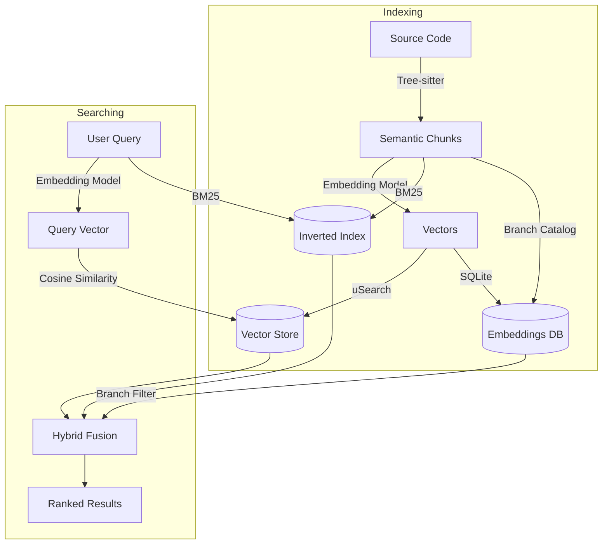

# opencode-codebase-index

[](https://www.npmjs.com/package/opencode-codebase-index)
[](https://opensource.org/licenses/MIT)
[](https://www.npmjs.com/package/opencode-codebase-index)
[](https://github.com/Helweg/opencode-codebase-index/actions)
[](https://nodejs.org/)

> **Stop grepping for concepts. Start searching for meaning.**

**opencode-codebase-index** brings semantic understanding to your [OpenCode](https://opencode.ai) workflow. Instead of guessing function names or grepping for keywords, ask your codebase questions in plain English.

## 🚀 Why Use This?

- 🧠 **Semantic Search**: Finds "user authentication" logic even if the function is named `check_creds`.
- ⚡ **Blazing Fast Indexing**: Powered by a Rust native module using `tree-sitter` and `usearch`. Incremental updates take milliseconds.
- 🌿 **Branch-Aware**: Seamlessly handles git branch switches — reuses embeddings, filters stale results.
- 🔒 **Privacy Focused**: Your vector index is stored locally in your project.
- 🔌 **Model Agnostic**: Works out-of-the-box with GitHub Copilot, OpenAI, Gemini, or local Ollama models.

## ⚡ Quick Start

1. **Install the plugin**
   ```bash
   npm install opencode-codebase-index
   ```

2. **Add to `opencode.json`**
   ```json
   {
     "plugin": ["opencode-codebase-index"]
   }
   ```

3. **Index your codebase**
   Run `/index` or ask the agent to index your codebase. This only needs to be done once — subsequent updates are incremental.

4. **Start Searching**
   Ask:
   > "Find the function that handles credit card validation errors"

## 🔍 See It In Action

**Scenario**: You're new to a codebase and need to fix a bug in the payment flow.

**Without Plugin (grep)**:
- `grep "payment" .` → 500 results (too many)
- `grep "card" .` → 200 results (mostly UI)
- `grep "stripe" .` → 50 results (maybe?)

**With `opencode-codebase-index`**:
You ask: *"Where is the payment validation logic?"*

Plugin returns:
```text
src/services/billing.ts:45  (Class PaymentValidator)
src/utils/stripe.ts:12      (Function validateCardToken)
src/api/checkout.ts:89      (Route handler for /pay)
```

## 🎯 When to Use What

| Scenario | Tool | Why |
|----------|------|-----|
| Don't know the function name | `codebase_search` | Semantic search finds by meaning |
| Exploring unfamiliar codebase | `codebase_search` | Discovers related code across files |
| Just need to find locations | `codebase_peek` | Returns metadata only, saves ~90% tokens |
| Know exact identifier | `grep` | Faster, finds all occurrences |
| Need ALL matches | `grep` | Semantic returns top N only |
| Mixed discovery + precision | `/find` (hybrid) | Best of both worlds |

**Rule of thumb**: `codebase_peek` to find locations → `Read` to examine → `grep` for precision.

## 📊 Token Usage

In our testing across open-source codebases (axios, express), we observed **up to 90% reduction in token usage** for conceptual queries like *"find the error handling middleware"*.

### Why It Saves Tokens

- **Without plugin**: Agent explores files, reads code, backtracks, explores more
- **With plugin**: Semantic search returns relevant code immediately → less exploration

### Key Takeaways

1. **Significant savings possible**: Up to 90% reduction in the best cases
2. **Results vary**: Savings depend on query type, codebase structure, and agent behavior
3. **Best for discovery**: Conceptual queries benefit most; exact identifier lookups should use grep
4. **Complements existing tools**: Provides a faster initial signal, doesn't replace grep/explore

### When the Plugin Helps Most

- **Conceptual queries**: "Where is the authentication logic?" (no keywords to grep for)
- **Unfamiliar codebases**: You don't know what to search for yet
- **Large codebases**: Semantic search scales better than exhaustive exploration

## 🛠️ How It Works



1. **Parsing**: We use `tree-sitter` to intelligently parse your code into meaningful blocks (functions, classes, interfaces). JSDoc comments and docstrings are automatically included with their associated code.

**Supported Languages**: TypeScript, JavaScript, Python, Rust, Go, Java, C#, Ruby, Bash, C, C++, JSON, TOML, YAML
2. **Chunking**: Large blocks are split with overlapping windows to preserve context across chunk boundaries.
3. **Embedding**: These blocks are converted into vector representations using your configured AI provider.
4. **Storage**: Embeddings are stored in SQLite (deduplicated by content hash) and vectors in `usearch` with F16 quantization for 50% memory savings. A branch catalog tracks which chunks exist on each branch.
5. **Hybrid Search**: Combines semantic similarity (vectors) with BM25 keyword matching, filtered by current branch.

**Performance characteristics:**
- **Incremental indexing**: ~50ms check time — only re-embeds changed files
- **Smart chunking**: Understands code structure to keep functions whole, with overlap for context
- **Native speed**: Core logic written in Rust for maximum performance
- **Memory efficient**: F16 vector quantization reduces index size by 50%
- **Branch-aware**: Automatically tracks which chunks exist on each git branch
- **Provider validation**: Detects embedding provider/model changes and requires rebuild to prevent garbage results

## 🌿 Branch-Aware Indexing

The plugin automatically detects git branches and optimizes indexing across branch switches.

### How It Works

When you switch branches, code changes but embeddings for unchanged content remain the same. The plugin:

1. **Stores embeddings by content hash**: Embeddings are deduplicated across branches
2. **Tracks branch membership**: A lightweight catalog tracks which chunks exist on each branch
3. **Filters search results**: Queries only return results relevant to the current branch

### Benefits

| Scenario | Without Branch Awareness | With Branch Awareness |
|----------|-------------------------|----------------------|
| Switch to feature branch | Re-index everything | Instant — reuse existing embeddings |
| Return to main | Re-index everything | Instant — catalog already exists |
| Search on branch | May return stale results | Only returns current branch's code |

### Automatic Behavior

- **Branch detection**: Automatically reads from `.git/HEAD`
- **Re-indexing on switch**: Triggers when you switch branches (via file watcher)
- **Legacy migration**: Automatically migrates old indexes on first run
- **Garbage collection**: Health check removes orphaned embeddings and chunks

### Storage Structure

```
.opencode/index/
├── codebase.db           # SQLite: embeddings, chunks, branch catalog
├── vectors.usearch       # Vector index (uSearch)
├── inverted-index.json   # BM25 keyword index
└── file-hashes.json      # File change detection
```

## 🧰 Tools Available

The plugin exposes these tools to the OpenCode agent:

### `codebase_search`
**The primary tool.** Searches code by describing behavior.
- **Use for**: Discovery, understanding flows, finding logic when you don't know the names.
- **Example**: `"find the middleware that sanitizes input"`

**Writing good queries:**

| ✅ Good queries (describe behavior) | ❌ Bad queries (too vague) |
|-------------------------------------|---------------------------|
| "function that validates email format" | "email" |
| "error handling for failed API calls" | "error" |
| "middleware that checks authentication" | "auth middleware" |
| "code that calculates shipping costs" | "shipping" |
| "where user permissions are checked" | "permissions" |

### `codebase_peek`
**Token-efficient discovery.** Returns only metadata (file, line, name, type) without code content.
- **Use for**: Finding WHERE code is before deciding what to read. Saves ~90% tokens vs `codebase_search`.
- **Example output**:
  ```
  [1] function "validatePayment" at src/billing.ts:45-67 (score: 0.92)
  [2] class "PaymentProcessor" at src/processor.ts:12-89 (score: 0.87)
  
  Use Read tool to examine specific files.
  ```
- **Workflow**: `codebase_peek` → find locations → `Read` specific files

### `index_codebase`
Manually trigger indexing.
- **Use for**: Forcing a re-index or checking stats.
- **Parameters**: `force` (rebuild all), `estimateOnly` (check costs), `verbose` (show skipped files and parse failures).

### `index_status`
Checks if the index is ready and healthy.

### `index_health_check`
Maintenance tool to remove stale entries from deleted files and orphaned embeddings/chunks from the database.

### `index_metrics`
Returns collected metrics about indexing and search performance. Requires `debug.enabled` and `debug.metrics` to be `true`.
- **Metrics include**: Files indexed, chunks created, cache hit rate, search timing breakdown, GC stats, embedding API call stats.

### `index_logs`
Returns recent debug logs with optional filtering.
- **Parameters**: `category` (optional: `search`, `embedding`, `cache`, `gc`, `branch`), `level` (optional: `error`, `warn`, `info`, `debug`), `limit` (default: 50).

## 🎮 Slash Commands

The plugin automatically registers these slash commands:

| Command | Description |
| ------- | ----------- |
| `/search <query>` | **Pure Semantic Search**. Best for "How does X work?" |
| `/find <query>` | **Hybrid Search**. Combines semantic search + grep. Best for "Find usage of X". |
| `/index` | **Update Index**. Forces a refresh of the codebase index. |
| `/status` | **Check Status**. Shows if indexed, chunk count, and provider info. |

## ⚙️ Configuration

Zero-config by default (uses `auto` mode). Customize in `.opencode/codebase-index.json`:

```json
{
  "embeddingProvider": "auto",
  "scope": "project",
  "indexing": {
    "autoIndex": false,
    "watchFiles": true,
    "maxFileSize": 1048576,
    "maxChunksPerFile": 100,
    "semanticOnly": false,
    "autoGc": true,
    "gcIntervalDays": 7,
    "gcOrphanThreshold": 100,
    "requireProjectMarker": true
  },
  "search": {
    "maxResults": 20,
    "minScore": 0.1,
    "hybridWeight": 0.5,
    "contextLines": 0
  },
  "debug": {
    "enabled": false,
    "logLevel": "info",
    "metrics": false
  }
}
```

### Options Reference

| Option | Default | Description |
|--------|---------|-------------|
| `embeddingProvider` | `"auto"` | Which AI to use: `auto`, `github-copilot`, `openai`, `google`, `ollama` |
| `scope` | `"project"` | `project` = index per repo, `global` = shared index across repos |
| **indexing** | | |
| `autoIndex` | `false` | Automatically index on plugin load |
| `watchFiles` | `true` | Re-index when files change |
| `maxFileSize` | `1048576` | Skip files larger than this (bytes). Default: 1MB |
| `maxChunksPerFile` | `100` | Maximum chunks to index per file (controls token costs for large files) |
| `semanticOnly` | `false` | When `true`, only index semantic nodes (functions, classes) and skip generic blocks |
| `retries` | `3` | Number of retry attempts for failed embedding API calls |
| `retryDelayMs` | `1000` | Delay between retries in milliseconds |
| `autoGc` | `true` | Automatically run garbage collection to remove orphaned embeddings/chunks |
| `gcIntervalDays` | `7` | Run GC on initialization if last GC was more than N days ago |
| `gcOrphanThreshold` | `100` | Run GC after indexing if orphan count exceeds this threshold |
| `requireProjectMarker` | `true` | Require a project marker (`.git`, `package.json`, etc.) to enable file watching and auto-indexing. Prevents accidentally indexing large directories like home. Set to `false` to index any directory. |
| **search** | | |
| `maxResults` | `20` | Maximum results to return |
| `minScore` | `0.1` | Minimum similarity score (0-1). Lower = more results |
| `hybridWeight` | `0.5` | Balance between keyword (1.0) and semantic (0.0) search |
| `contextLines` | `0` | Extra lines to include before/after each match |
| **debug** | | |
| `enabled` | `false` | Enable debug logging and metrics collection |
| `logLevel` | `"info"` | Log level: `error`, `warn`, `info`, `debug` |
| `logSearch` | `true` | Log search operations with timing breakdown |
| `logEmbedding` | `true` | Log embedding API calls (success, error, rate-limit) |
| `logCache` | `true` | Log cache hits and misses |
| `logGc` | `true` | Log garbage collection operations |
| `logBranch` | `true` | Log branch detection and switches |
| `metrics` | `false` | Enable metrics collection (indexing stats, search timing, cache performance) |

### Embedding Providers
The plugin automatically detects available credentials in this order:
1. **GitHub Copilot** (Free if you have it)
2. **OpenAI** (Standard Embeddings)
3. **Google** (Gemini Embeddings)
4. **Ollama** (Local/Private - requires `nomic-embed-text`)

### Rate Limits by Provider

Each provider has different rate limits. The plugin automatically adjusts concurrency and delays:

| Provider | Concurrency | Delay | Best For |
|----------|-------------|-------|----------|
| **GitHub Copilot** | 1 | 4s | Small codebases (<1k files) |
| **OpenAI** | 3 | 500ms | Medium codebases |
| **Google** | 5 | 200ms | Medium-large codebases |
| **Ollama** | 5 | None | Large codebases (10k+ files) |

**For large codebases**, use Ollama locally to avoid rate limits:

```bash
# Install the embedding model
ollama pull nomic-embed-text
```

```json
// .opencode/codebase-index.json
{
  "embeddingProvider": "ollama"
}
```

## 📈 Performance

The plugin is built for speed with a Rust native module. Here are typical performance numbers (Apple M1):

### Parsing (tree-sitter)

| Files | Chunks | Time |
|-------|--------|------|
| 100 | 1,200 | ~7ms |
| 500 | 6,000 | ~32ms |

### Vector Search (usearch)

| Index Size | Search Time | Throughput |
|------------|-------------|------------|
| 1,000 vectors | 0.7ms | 1,400 ops/sec |
| 5,000 vectors | 1.2ms | 850 ops/sec |
| 10,000 vectors | 1.3ms | 780 ops/sec |

### Database Operations (SQLite with batch)

| Operation | 1,000 items | 10,000 items |
|-----------|-------------|--------------|
| Insert chunks | 4ms | 44ms |
| Add to branch | 2ms | 22ms |
| Check embedding exists | <0.01ms | <0.01ms |

### Batch vs Sequential Performance

Batch operations provide significant speedups:

| Operation | Sequential | Batch | Speedup |
|-----------|------------|-------|---------|
| Insert 1,000 chunks | 38ms | 4ms | **~10x** |
| Add 1,000 to branch | 29ms | 2ms | **~14x** |
| Insert 1,000 embeddings | 59ms | 40ms | **~1.5x** |

Run benchmarks yourself: `npx tsx benchmarks/run.ts`

## 🎯 Choosing a Provider

Use this decision tree to pick the right embedding provider:

```
                    ┌─────────────────────────┐
                    │ Do you have Copilot?    │
                    └───────────┬─────────────┘
                          ┌─────┴─────┐
                         YES          NO
                          │            │
              ┌───────────▼───────┐    │
              │ Codebase < 1k     │    │
              │ files?            │    │
              └─────────┬─────────┘    │
                  ┌─────┴─────┐        │
                 YES          NO       │
                  │            │       │
                  ▼            │       │
           ┌──────────┐        │       │
           │ Copilot  │        │       │
           │ (free)   │        │       │
           └──────────┘        │       │
                               ▼       ▼
                    ┌─────────────────────────┐
                    │ Need fastest indexing?  │
                    └───────────┬─────────────┘
                          ┌─────┴─────┐
                         YES          NO
                          │            │
                          ▼            ▼
                   ┌──────────┐ ┌──────────────┐
                   │ Ollama   │ │ OpenAI or    │
                   │ (local)  │ │ Google       │
                   └──────────┘ └──────────────┘
```

### Provider Comparison

| Provider | Speed | Cost | Privacy | Best For |
|----------|-------|------|---------|----------|
| **Ollama** | Fastest | Free | Full | Large codebases, privacy-sensitive |
| **GitHub Copilot** | Slow (rate limited) | Free* | Cloud | Small codebases, existing subscribers |
| **OpenAI** | Medium | ~$0.0001/1K tokens | Cloud | General use |
| **Google** | Fast | Free tier available | Cloud | Medium-large codebases |

*Requires active Copilot subscription

### Setup by Provider

**Ollama (Recommended for large codebases)**
```bash
ollama pull nomic-embed-text
```
```json
{ "embeddingProvider": "ollama" }
```

**OpenAI**
```bash
export OPENAI_API_KEY=sk-...
```
```json
{ "embeddingProvider": "openai" }
```

**Google**
```bash
export GOOGLE_API_KEY=...
```
```json
{ "embeddingProvider": "google" }
```

**GitHub Copilot**
No setup needed if you have an active Copilot subscription.
```json
{ "embeddingProvider": "github-copilot" }
```

## ⚠️ Tradeoffs

Be aware of these characteristics:

| Aspect | Reality |
|--------|---------|
| **Search latency** | ~800-1000ms per query (embedding API call) |
| **First index** | Takes time depending on codebase size (e.g., ~30s for 500 chunks) |
| **Requires API** | Needs an embedding provider (Copilot, OpenAI, Google, or local Ollama) |
| **Token costs** | Uses embedding tokens (free with Copilot, minimal with others) |
| **Best for** | Discovery and exploration, not exhaustive matching |

## 💻 Local Development

1. **Build**:
   ```bash
   npm run build
   ```

2. **Register in Test Project** (use `file://` URL in `opencode.json`):
   ```json
   {
     "plugin": [
       "file:///path/to/opencode-codebase-index"
     ]
   }
   ```
   
   This loads directly from your source directory, so changes take effect after rebuilding.

## 🤝 Contributing

1. Fork the repository
2. Create a feature branch: `git checkout -b feature/my-feature`
3. Make your changes and add tests
4. Run checks: `npm run build && npm run test:run && npm run lint`
5. Commit: `git commit -m "feat: add my feature"`
6. Push and open a pull request

CI will automatically run tests and type checking on your PR.

### Project Structure

```
├── src/
│   ├── index.ts              # Plugin entry point
│   ├── config/               # Configuration schema
│   ├── embeddings/           # Provider detection and API calls
│   ├── indexer/              # Core indexing logic + inverted index
│   ├── git/                  # Git utilities (branch detection)
│   ├── tools/                # OpenCode tool definitions
│   ├── utils/                # File collection, cost estimation
│   ├── native/               # Rust native module wrapper
│   └── watcher/              # File/git change watcher
├── native/
│   └── src/                  # Rust: tree-sitter, usearch, xxhash, SQLite
├── tests/                    # Unit tests (vitest)
├── commands/                 # Slash command definitions
├── skill/                    # Agent skill guidance
└── .github/workflows/        # CI/CD (test, build, publish)
```

### Native Module

The Rust native module handles performance-critical operations:
- **tree-sitter**: Language-aware code parsing with JSDoc/docstring extraction
- **usearch**: High-performance vector similarity search with F16 quantization
- **SQLite**: Persistent storage for embeddings, chunks, and branch catalog
- **BM25 inverted index**: Fast keyword search for hybrid retrieval
- **xxhash**: Fast content hashing for change detection

Rebuild with: `npm run build:native` (requires Rust toolchain)

## License

MIT
