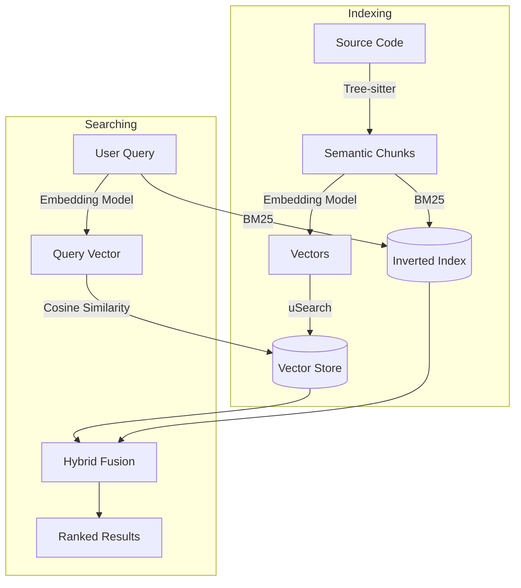

# opencode-codebase-index

[](https://www.npmjs.com/package/opencode-codebase-index)
[](https://opensource.org/licenses/MIT)
[](https://www.npmjs.com/package/opencode-codebase-index)
[](https://github.com/Helweg/opencode-codebase-index/actions)
[](https://nodejs.org/)

> **Stop grepping for concepts. Start searching for meaning.**

**opencode-codebase-index** brings semantic understanding to your [OpenCode](https://opencode.ai) workflow. Instead of guessing function names or grepping for keywords, ask your codebase questions in plain English.

## 🚀 Why Use This?

- 🧠 **Semantic Search**: Finds "user authentication" logic even if the function is named `check_creds`.
- ⚡ **Blazing Fast Indexing**: Powered by a Rust native module using `tree-sitter` and `usearch`. Incremental updates take milliseconds.
- 🔒 **Privacy Focused**: Your vector index is stored locally in your project.
- 🔌 **Model Agnostic**: Works out-of-the-box with GitHub Copilot, OpenAI, Gemini, or local Ollama models.

## ⚡ Quick Start

1. **Install the plugin**
   ```bash
   npm install opencode-codebase-index
   ```

2. **Add to `opencode.json`**
   ```json
   {
     "plugin": ["opencode-codebase-index"]
   }
   ```

3. **Start Searching**
   Load OpenCode and ask:
   > "Find the function that handles credit card validation errors"

   *The plugin will automatically index your codebase on the first run.*

## 🔍 See It In Action

**Scenario**: You're new to a codebase and need to fix a bug in the payment flow.

**Without Plugin (grep)**:
- `grep "payment" .` → 500 results (too many)
- `grep "card" .` → 200 results (mostly UI)
- `grep "stripe" .` → 50 results (maybe?)

**With `opencode-codebase-index`**:
You ask: *"Where is the payment validation logic?"*

Plugin returns:
```text
src/services/billing.ts:45  (Class PaymentValidator)
src/utils/stripe.ts:12      (Function validateCardToken)
src/api/checkout.ts:89      (Route handler for /pay)
```

## 🎯 When to Use What

| Scenario | Tool | Why |
|----------|------|-----|
| Don't know the function name | `codebase_search` | Semantic search finds by meaning |
| Exploring unfamiliar codebase | `codebase_search` | Discovers related code across files |
| Know exact identifier | `grep` | Faster, finds all occurrences |
| Need ALL matches | `grep` | Semantic returns top N only |
| Mixed discovery + precision | `/find` (hybrid) | Best of both worlds |

**Rule of thumb**: Semantic search for discovery → grep for precision.

## 📊 Token Usage Benchmarks

We tested the query *"find the error handling middleware"* across multiple open-source codebases:

| Codebase | Files | Without Plugin | With Plugin | Savings |
|----------|-------|----------------|-------------|---------|
| [axios](https://github.com/axios/axios) | 170 | 126,051 tokens | 3,377 tokens | **97%** |
| [express](https://github.com/expressjs/express) | 670 | 21,727 tokens | 2,458 tokens | **89%** |

### Key Takeaways

1. **Massive token savings**: 89-97% reduction across tested codebases
2. **Scales with complexity**: Without the plugin, the agent explores more files; with it, semantic search provides immediate context
3. **Complements existing tools**: The plugin doesn't replace grep/explore—it provides a faster initial signal that reduces exploration overhead
4. **Same answer quality**: Both approaches found the relevant error handling code

### When the Plugin Helps Most

- **Conceptual queries**: "Where is the authentication logic?" (no keywords to grep for)
- **Unfamiliar codebases**: You don't know what to search for yet
- **Cost-sensitive workflows**: 89-97% fewer tokens adds up significantly
- **Large codebases**: Semantic search scales better than exhaustive grep

## 🛠️ How It Works



1. **Parsing**: We use `tree-sitter` to intelligently parse your code into meaningful blocks (functions, classes, interfaces). JSDoc comments and docstrings are automatically included with their associated code.
2. **Chunking**: Large blocks are split with overlapping windows to preserve context across chunk boundaries.
3. **Embedding**: These blocks are converted into vector representations using your configured AI provider.
4. **Storage**: Vectors are stored in a high-performance local index using `usearch` with F16 quantization for 50% memory savings.
5. **Hybrid Search**: Combines semantic similarity (vectors) with BM25 keyword matching for best results.

**Performance characteristics:**
- **Incremental indexing**: ~50ms check time — only re-embeds changed files
- **Smart chunking**: Understands code structure to keep functions whole, with overlap for context
- **Native speed**: Core logic written in Rust for maximum performance
- **Memory efficient**: F16 vector quantization reduces index size by 50%

## 🧰 Tools Available

The plugin exposes these tools to the OpenCode agent:

### `codebase_search`
**The primary tool.** Searches code by describing behavior.
- **Use for**: Discovery, understanding flows, finding logic when you don't know the names.
- **Example**: `"find the middleware that sanitizes input"`

**Writing good queries:**

| ✅ Good queries (describe behavior) | ❌ Bad queries (too vague) |
|-------------------------------------|---------------------------|
| "function that validates email format" | "email" |
| "error handling for failed API calls" | "error" |
| "middleware that checks authentication" | "auth middleware" |
| "code that calculates shipping costs" | "shipping" |
| "where user permissions are checked" | "permissions" |

### `index_codebase`
Manually trigger indexing.
- **Use for**: Forcing a re-index or checking stats.
- **Parameters**: `force` (rebuild all), `estimateOnly` (check costs), `verbose` (show skipped files and parse failures).

### `index_status`
Checks if the index is ready and healthy.

### `index_health_check`
Maintenance tool to remove stale entries from deleted files.

## 🎮 Slash Commands

For easier access, you can add slash commands to your project.

Copy the commands:
```bash
cp -r node_modules/opencode-codebase-index/commands/* .opencode/command/
```

| Command | Description |
| ------- | ----------- |
| `/search <query>` | **Pure Semantic Search**. Best for "How does X work?" |
| `/find <query>` | **Hybrid Search**. Combines semantic search + grep. Best for "Find usage of X". |
| `/index` | **Update Index**. Forces a refresh of the codebase index. |

## ⚙️ Configuration

Zero-config by default (uses `auto` mode). Customize in `.opencode/codebase-index.json`:

```json
{
  "embeddingProvider": "auto",
  "scope": "project",
  "indexing": {
    "autoIndex": false,
    "watchFiles": true,
    "maxFileSize": 1048576,
    "maxChunksPerFile": 100,
    "semanticOnly": false
  },
  "search": {
    "maxResults": 20,
    "minScore": 0.1,
    "hybridWeight": 0.5,
    "contextLines": 0
  }
}
```

### Options Reference

| Option | Default | Description |
|--------|---------|-------------|
| `embeddingProvider` | `"auto"` | Which AI to use: `auto`, `github-copilot`, `openai`, `google`, `ollama` |
| `scope` | `"project"` | `project` = index per repo, `global` = shared index across repos |
| **indexing** | | |
| `autoIndex` | `false` | Automatically index on plugin load |
| `watchFiles` | `true` | Re-index when files change |
| `maxFileSize` | `1048576` | Skip files larger than this (bytes). Default: 1MB |
| `maxChunksPerFile` | `100` | Maximum chunks to index per file (controls token costs for large files) |
| `semanticOnly` | `false` | When `true`, only index semantic nodes (functions, classes) and skip generic blocks |
| `retries` | `3` | Number of retry attempts for failed embedding API calls |
| `retryDelayMs` | `1000` | Delay between retries in milliseconds |
| **search** | | |
| `maxResults` | `20` | Maximum results to return |
| `minScore` | `0.1` | Minimum similarity score (0-1). Lower = more results |
| `hybridWeight` | `0.5` | Balance between keyword (1.0) and semantic (0.0) search |
| `contextLines` | `0` | Extra lines to include before/after each match |

### Embedding Providers
The plugin automatically detects available credentials in this order:
1. **GitHub Copilot** (Free if you have it)
2. **OpenAI** (Standard Embeddings)
3. **Google** (Gemini Embeddings)
4. **Ollama** (Local/Private - requires `nomic-embed-text`)

## ⚠️ Tradeoffs

Be aware of these characteristics:

| Aspect | Reality |
|--------|---------|
| **Search latency** | ~800-1000ms per query (embedding API call) |
| **First index** | Takes time depending on codebase size (e.g., ~30s for 500 chunks) |
| **Requires API** | Needs an embedding provider (Copilot, OpenAI, Google, or local Ollama) |
| **Token costs** | Uses embedding tokens (free with Copilot, minimal with others) |
| **Best for** | Discovery and exploration, not exhaustive matching |

## 💻 Local Development

1. **Build**:
   ```bash
   npm run build
   ```

2. **Deploy to OpenCode Cache**:
   ```bash
   # Deploy script
   rm -rf ~/.cache/opencode/node_modules/opencode-codebase-index
   mkdir -p ~/.cache/opencode/node_modules/opencode-codebase-index
   cp -R dist native commands skill package.json ~/.cache/opencode/node_modules/opencode-codebase-index/
   ```

3. **Register in Test Project**:
   ```bash
   mkdir -p .opencode/plugin
    echo 'export { default } from "$HOME/.cache/opencode/node_modules/opencode-codebase-index/dist/index.js"' > .opencode/plugin/codebase-index.ts
    ```

## 🤝 Contributing

1. Fork the repository
2. Create a feature branch: `git checkout -b feature/my-feature`
3. Make your changes and add tests
4. Run checks: `npm run build && npm run test:run && npm run lint`
5. Commit: `git commit -m "feat: add my feature"`
6. Push and open a pull request

CI will automatically run tests and type checking on your PR.

### Project Structure

```
├── src/
│   ├── index.ts              # Plugin entry point
│   ├── config/               # Configuration schema
│   ├── embeddings/           # Provider detection and API calls
│   ├── indexer/              # Core indexing logic + inverted index
│   ├── tools/                # OpenCode tool definitions
│   ├── utils/                # File collection, cost estimation
│   ├── native/               # Rust native module wrapper
│   └── watcher/              # File change watcher
├── native/
│   └── src/                  # Rust: tree-sitter, usearch, xxhash
├── tests/                    # Unit tests (vitest)
├── commands/                 # Slash command definitions
├── skill/                    # Agent skill guidance
└── .github/workflows/        # CI/CD (test, build, publish)
```

### Native Module

The Rust native module handles performance-critical operations:
- **tree-sitter**: Language-aware code parsing with JSDoc/docstring extraction
- **usearch**: High-performance vector similarity search with F16 quantization
- **BM25 inverted index**: Fast keyword search for hybrid retrieval
- **xxhash**: Fast content hashing for change detection

Rebuild with: `npm run build:native` (requires Rust toolchain)

## License

MIT
